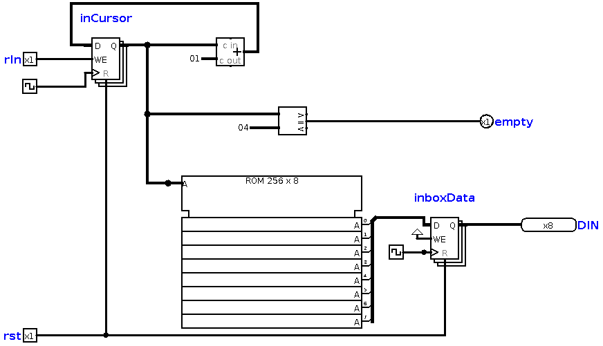
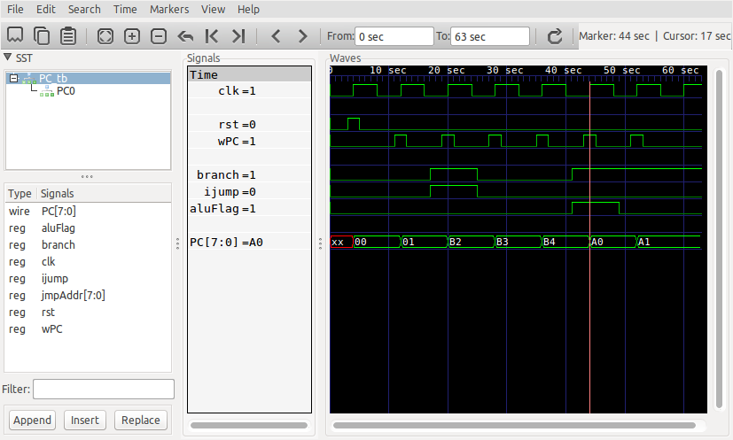

# Human Resource Machine CPU (Verilog)

- [Human Resource Machine CPU (Verilog)](#human-resource-machine-cpu-verilog)
- [Introduction](#introduction)
    - [Disclaimer](#disclaimer)
    - [CPU Architecture components](#cpu-architecture-components)
- [Instruction Set Architecture](#instruction-set-architecture)
- [Microarchitecture](#microarchitecture)
    - [Top module](#top-module)
    - [Control Unit](#control-unit)
    - [Inbox](#inbox)
        - [Logisim circuit](#logisim-circuit)
    - [Outbox](#outbox)
        - [Logisim circuit](#logisim-circuit)
    - [Register](#register)
        - [Logisim circuit](#logisim-circuit)
    - [Memory](#memory)
        - [Logisim circuit](#logisim-circuit)
    - [PC (Program Counter)](#pc-program-counter)
        - [Logisim circuit](#logisim-circuit)
        - [Circuit diagram](#circuit-diagram)
        - [Testbench simulation](#testbench-simulation)
    - [PROG (Program ROM)](#prog-program-rom)
        - [Logisim circuit](#logisim-circuit)
        - [Circuit diagram](#circuit-diagram)
        - [Testbench simulation](#testbench-simulation)
    - [IR (Instruction Register)](#ir-instruction-register)
        - [Logisim circuit](#logisim-circuit)
        - [Circuit diagram](#circuit-diagram)
        - [Testbench simulation](#testbench-simulation)
    - [ALU](#alu)
        - [Logisim circuit](#logisim-circuit)
- [Simulations in Logisim](#simulations-in-logisim)
    - [Year 4](#year-4)
- [Tools used](#tools-used)

# Introduction

This personal project aims at designing a soft core CPU in Verilog , synthetizable in an FPGA that behaves like the game [Human Resource Machine](https://tomorrowcorporation.com/humanresourcemachine) by Tomorrow Corp.

Here's an extract of an article on HRM, posted on [IEEE's Spectrum site](https://spectrum.ieee.org/geek-life/reviews/three-computer-games-that-make-assembly-language-fun):
>In this game the player takes on the role of an office worker who must handle numbers and letters arriving on an “in” conveyor belt and put the desired results on an “out” conveyor belt.
>
>[...]Those in the know will recognize the office worker as a register, the temporary workspace on the office floor as random access memory, and many of the challenges as classic introductory computer science problems.[...]

My resulting CPU design is a **8-bit multi-cycle RISC architecture** with **variable length instructions**.

For impatients, you can see a demo at the end: [HRM Year 4 in Logisim](#year-4).

## Disclaimer

- I'm not an Computer Science Engineer, nor a hardware engineer. I'm a novice in digital electronics, but I enjoy learning from books, youtube videos and tutorials online.
- This is a strictly personal project, with entertaining and educational objectives exlusively.
- It's not optimized in any way. I'll be happy if it even gets to work.
- It's a work in progress, so it's incomplete (and may never be complete).
- Documentation is also incomplete (and may never be complete).

## CPU Architecture components

We can see how the game actually represents a CPU and it's internals.

Here are some elements that make our analogy:

| HRM  element  |  #   |CPU element          |
| ------------- |:---: |-------------------- |
| Office Worker | 1    |Register             |
| In/Out belts  | 2, 3 |I/O                  |
| Floor Tiles   | 4    |Memory (RAM)         |
| Program       | 5    | Instructions             |
|               | 6    |Program Counter      |
|               | 7    |Instruction Register |

# Instruction Set Architecture

The instruction set is the one from the HRM game, made of a reduce set of 11 instructions, 6 of which can function in direct and indirect addressing modes.

*TODO: for now, I'm only focusing on Direct Addressing mode. Indirect mode will require some changes in the Control Unit.*

For now, the latest version of the instruction set is described in this [Google Spreadsheet](https://docs.google.com/spreadsheets/d/1WEB_RK878GqC6Xb1BZOdD-QtXDiJCOBEF22lt2ebCDg/edit?usp=sharing).

The current implementation status is represented by the color in the first column (Green: implemented in Logisim, white: pending).

I have added a couple of instructions that were not in the HRM game: SET, and HALT.

Instruction are encoded with 1 word (8 bit). Some instructions have one  operand which is also encoded with 8 bits. So the length of instruction is variable: some are 1 word wide, others are two words wide.

# Microarchitecture

The microarchitecture is very loosely inspired from MIPS architecture. The CPU is a multi-cycle CPU with a Harvard design.

The following block diagram shows the components, the data path and control path (in red dashed line).

Sections below detail each module individually.

## Top module

The top module shows all the inner modules, the Data Path and Control Path:

## Control Unit

The **Control Unit** is a Finite State Machine. It takes as input the instruction, and some external signals, and generate control signals that will orchestrate the data flow along the data path.

The following chart shows the control signals for some of the instruction:

Control Signals:

Below is the corresponding FSM:

Note:
- Logisim FSM addon tool doesn't seem to allow transition to the same state, that is why the HALT state doesn't have any transition out of it. It should loop on itself. Anyway in Logisim's simulation it behaves as expected.

## Inbox

### Logisim circuit

Notes:
- When all the elements have been read (popped out of the IN belt)
, the empty signal is asserted. Next INBOX instructions will go to HALT state.

## Outbox

### Logisim circuit

## Register

### Logisim circuit

## Memory

-  0x00-0x1f: 32 x 1 byte, general purpose ram (*Tiles* in HRM)

### Logisim circuit

## PC (Program Counter)

- Reinitialized to 0x00 upon reset
- Increments by 1 (1byte) when wPC=1
- Branch signals:
    - Inconditional jump (JUMP) when *( branch && ijump )*
    - Conditional jumps (JUMPZ/N) only when *( branch && aluFlag )*

### Logisim circuit

### Circuit diagram

### Testbench simulation

## PROG (Program ROM)

### Logisim circuit

### Circuit diagram

### Testbench simulation

## IR (Instruction Register)

### Logisim circuit

### Circuit diagram

### Testbench simulation

## ALU

The ALU can perform 6 operations depending on signal aluCtl:

| aluCtl | Operation | Output |
|:------:|:---------:|:------:|
|  0x0   |  R + M    | aluOut |
|  0x1   |  R - M    | aluOut |
|  x1x   |  R = 0 ?  | flag   |
|  0x1   |  R < 0 ?  | flag   |
|  1x0   |  M + 1    | aluOut |
|  1x1   |  M - 1    | aluOut |

Notes:
- Clearly, aluCtl could be split in two, and its bits reorganized (but it would mean change a lot of things and all the documentation and images...)

### Logisim circuit

# Simulations in Logisim

## Year 4

This is a simple example of the game, level 4: in this level, the worker has to take each pair of elements from Inbox, and put them on the Outbox in reverse order.

First let see the level in the game:

Now, we'll load the same program in our PROG memory, load the INBOX, clear the OUTBOX, and run the simulation in Logisim.

Program:

    init:
    00: 00    ; INBOX 
    01: 30 2  ; COPYTO 2
    03: 00    ; INBOX 
    04: 10    ; OUTBOX 
    05: 20 2  ; COPYFROM 2
    07: 10    ; OUTBOX 
    08: 80 00 ; JUMP init

In Logisim that is:

    v2.0 raw
    00 30 2 00 10 20 2 10 80 00 

We load the PROG in Logisim:

Inbox:

The first element of the INBOX memory is the number of elements in the INBOX.

| INBOX  |
|:------:|
|  0x06  |
|  0x03  |
|  0x09  |
|  0x5a  |
|  0x48  |
|  0x02  |
|  0x07  |

In Logisim that is:

    v2.0 raw
    06 03 09 5a 48 02 07

We load the INBOX in Logisim:

We clear the OUTBOX:

And we run the simulation:

Once the CPU halts (after trying to run INBOX instruction on an empty INBOX), we can see the resulting OUTBOX memory:

Indeed, the elements have been inverted two by two.

# Tools used

Pending to add reference/links.

- Logisim Evolution with FSM Addon
- Visual Studio Code
- Fizzim
- Opensource FPGA toolchain
- SchemeIt
